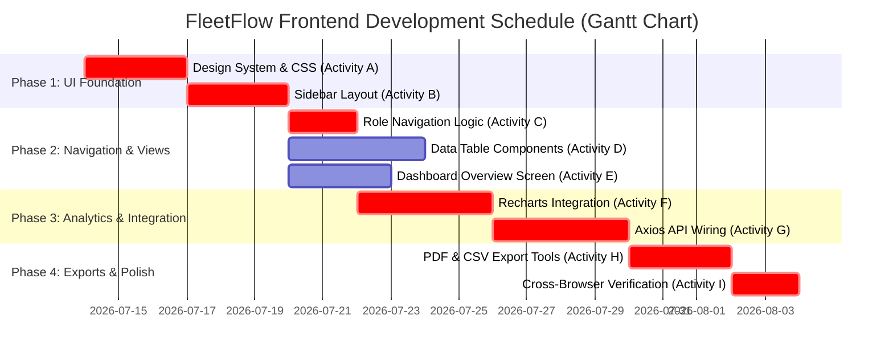

# Software Project Management: Task-5 (PLT-5)
## Student: Rishi Detroja (23BCE288)
### Project: FleetFlow (Project Scheduling, Network Diagram & Gantt Chart)

---

## 📌 Overview
Task-5 requires preparing **Project Scheduling** deliverables for **FleetFlow**, including an **Activity Network Diagram**, task dependency mapping, critical path calculation, and a **Gantt Chart** timeline.

---

## 📋 1. Project Activity List & Dependency Table

Below are the key development activities, estimated durations, and activity dependencies for the frontend application:

| Activity ID | Task Description | Duration (Days) | Predecessors (Dependencies) | Critical Path? |
| :--- | :--- | :---: | :---: | :---: |
| **A** | Design System & CSS Variables (`index.css`) | 3 | None | **Yes** |
| **B** | Layout Components & Sidebar Navigation | 3 | A | **Yes** |
| **C** | Role-Based Menu Filtering Logic | 2 | B | **Yes** |
| **D** | Data Tables & Form Input Components | 4 | B | No (Slack: 2 days) |
| **E** | Dashboard Overview Screen & Summary Cards | 3 | B | No (Slack: 3 days) |
| **F** | Recharts Integration (Vehicle Pie & Expense Bars) | 4 | C, E | **Yes** |
| **G** | Axios API Integration & State Wiring | 4 | F | **Yes** |
| **H** | PDF Report Generator & CSV Exporter | 3 | G | **Yes** |
| **I** | UI Responsiveness & Browser Testing | 2 | H | **Yes** |

* **Total Project Duration:** 24 Days
* **Critical Path:** **A → B → C → F → G → H → I** (Total = 3 + 3 + 2 + 4 + 4 + 3 + 2 = 24 Days)

---

## 🕸️ 2. Activity Network Diagram (Precedence Diagramming Method)

```text
[ Start ]
    │
    ▼
  [ A ] Design System & CSS (3d)
    │
    ▼
  [ B ] Sidebar Layout (3d)
    ├───────────────────────────────┐
    │                               │
    ▼                               ▼
  [ C ] Role Navigation (2d)      [ D ] Data Tables (4d) / [ E ] Dashboard Screen (3d)
    │                               │
    └───────────────┬───────────────┘
                    │
                    ▼
  [ F ] Recharts Integration (4d)
    │
    ▼
  [ G ] Axios API Integration (4d)
    │
    ▼
  [ H ] PDF & CSV Export Utilities (3d)
    │
    ▼
  [ I ] Cross-Browser Testing (2d)
    │
    ▼
 [ Finish ]
```

---

## 📅 3. Project Gantt Chart (Mermaid Visualization)



---

## 🎯 4. Key Milestones & Critical Path Summary

1. **Critical Path Activities:** Tasks with **zero slack time** (A, B, C, F, G, H, I). Any delay in these UI components or API wiring steps will directly push back project delivery.
2. **Float / Slack Time:** Tasks D and E have float time (2 to 3 days). Creating static data tables or summary cards can occur in parallel while navigation and chart wiring progress on the main critical path.
