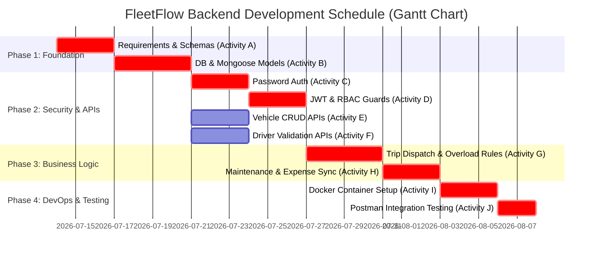

# Software Project Management: Task-5 (PLT-5)
## Student: Vaidik Rokad (23BCE291)
### Project: FleetFlow (Project Scheduling, Network Diagram & Gantt Chart)

---

## 📌 Overview
Task-5 requires preparing **Project Scheduling** deliverables for **FleetFlow**, including an **Activity Network Diagram**, task dependency mapping, critical path calculation, and a **Gantt Chart** timeline.

---

## 📋 1. Project Activity List & Dependency Table

Below are the key development activities, estimated durations, and activity dependencies:

| Activity ID | Task Description | Duration (Days) | Predecessors (Dependencies) | Critical Path? |
| :--- | :--- | :---: | :---: | :---: |
| **A** | Requirements & Schema Definition | 3 | None | **Yes** |
| **B** | Database Connection & Mongoose Models | 4 | A | **Yes** |
| **C** | Password Encryption & User Auth Controller | 3 | B | **Yes** |
| **D** | JWT Cookie Auth & RBAC Guard Middleware | 3 | C | **Yes** |
| **E** | Vehicle Registry CRUD APIs | 3 | B | No (Slack: 3 days) |
| **F** | Driver Registry & License Validation APIs | 3 | B | No (Slack: 3 days) |
| **G** | Trip Dispatch & Capacity Overload Check Logic | 4 | D, E, F | **Yes** |
| **H** | Maintenance Auto-Sync & Expense Controllers | 3 | G | **Yes** |
| **I** | Docker Containerization (`Dockerfile` & Scripts) | 3 | H | **Yes** |
| **J** | Integration Testing & Postman Collection | 2 | I | **Yes** |

* **Total Project Duration:** 25 Days
* **Critical Path:** **A → B → C → D → G → H → I → J** (Total = 3 + 4 + 3 + 3 + 4 + 3 + 3 + 2 = 25 Days)

---

## 🕸️ 2. Activity Network Diagram (Precedence Diagramming Method)

```text
[ Start ]
    │
    ▼
  [ A ] Requirements & Schema (3d)
    │
    ▼
  [ B ] Database Models (4d)
    ├───────────────────────────────┐
    │                               │
    ▼                               ▼
  [ C ] Password Auth (3d)       [ E ] Vehicle APIs (3d) / [ F ] Driver APIs (3d)
    │                               │
    ▼                               │
  [ D ] JWT & RBAC Guard (3d)       │
    │                               │
    └───────────────┬───────────────┘
                    │
                    ▼
  [ G ] Trip Dispatch & Overload Guard (4d)
    │
    ▼
  [ H ] Maintenance & Expenses (3d)
    │
    ▼
  [ I ] Docker Setup (3d)
    │
    ▼
  [ J ] Postman & API Verification (2d)
    │
    ▼
 [ Finish ]
```

---

## 📅 3. Project Gantt Chart (Mermaid Visualization)



---

## 🎯 4. Key Milestones & Critical Path Summary

1. **Critical Path Activities:** Tasks with **zero slack time** (A, B, C, D, G, H, I, J). Any delay in these activities will directly delay project completion.
2. **Float / Slack Time:** Tasks E and F have 3 days of float time, meaning minor delays in Vehicle or Driver CRUD endpoints will not affect the overall launch date as long as they finish before Trip Dispatching (Activity G) begins.
